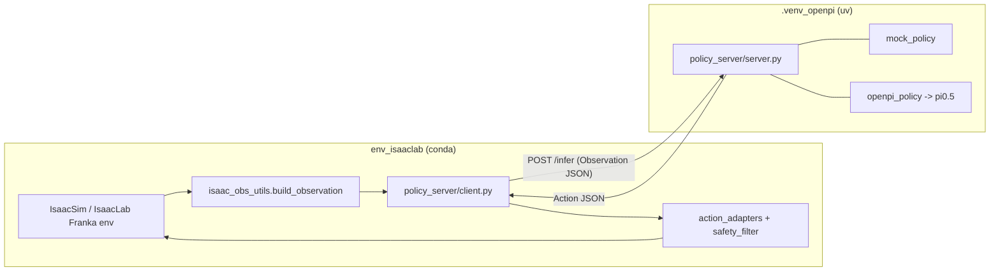

# Architecture & Data Flow

## Two isolated environments, one HTTP boundary



The HTTP boundary (default `:8008`) is the only coupling. The IsaacLab side needs
no OpenPI/JAX deps; the OpenPI side needs no IsaacSim. Either backend (mock /
openpi) is swappable without touching the IsaacLab code.

## Closed-loop control sequence

```mermaid
sequenceDiagram
  participant Env as IsaacLab Env
  participant C as client.py
  participant S as server.py
  participant P as policy (mock/pi0.5)
  loop each step (<= max_steps)
    Env->>C: build Observation (robot state, [images], [objects])
    C->>S: POST /infer {Observation}
    S->>P: infer(obs)
    P-->>S: Action {delta_ee / joint, gripper, chunk}
    S-->>C: {action, latency_ms}
    C->>C: shape check; safe fallback on timeout/error
    C->>Env: safety_filter -> env action tensor -> env.step()
    Env->>Env: record trajectory line (jsonl)
  end
  Env->>Env: write eval_policy_*.json (success, latency, freq, clips)
```

## Schemas

### Observation (`adapters/policy_server/schemas.py`)
```
timestamp: float (s)
task_instruction: str
robot: { joint_positions[rad], joint_velocities[rad/s],
         ee_position[m xyz], ee_quat[xyzw], gripper_width[m] }
images: { front_rgb: ImageRef, wrist_rgb: ImageRef }   # mode none|path|base64
objects: [ { name, position[m], quat[xyzw], confidence, ... } ]  # FoundationPose-ready
metadata: { env_name, episode_id, step_id }
```

### Action
```
action_type: delta_ee_pose | joint_position | joint_delta
delta_ee_position[3 m], delta_ee_rot[3 rad axis-angle], gripper[-1..1]
joint_targets[rad]?      chunk[[...]]?      raw_model_output[]?
```
Canonical 7D: `[dx, dy, dz, rx, ry, rz, gripper]`.

### Dataset (LeRobot, OpenPI-compatible)
```
features: image (HxWx3 uint8), wrist_image, state (float32), actions (float32), task (str)
```
Plus a normalized intermediate (`states.npy`, `actions.npy`, `episode_index.npy`,
`images/`, `metadata.json`) that is always written even when LeRobot build is skipped.

## Units & conventions (single source of truth)
- length/position **meters**; rotation **radians**; quaternion **XYZW** (unless `_wxyz`).
- gripper action normalized **[-1, 1]** (-1 close, +1 open); gripper_width is meters.
- Env-kind decides the action layout: `ik_rel` (7D delta), `ik_abs` (8D abs pose,
  delta integrated onto current EE), `joint` (8D = 7 joints + gripper).

## Safety (`configs/safety_limits.yaml`)
Position ≤0.03 m/step (L2 + per-axis), rotation ≤0.15 rad/step, gripper clip,
joint clamps, workspace box, NaN/Inf scrub, 5 consecutive policy errors → reset.
All clips counted → `num_safety_clips` in the eval summary.
